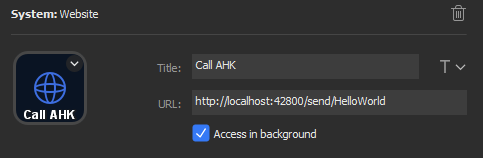

## Hotkeyless AutoHotkey

The **AutoHotkey** (AHK) environment is a *powerful tool* to enhance your productivity and *speed up your workflow*. There are so many possibilities and use cases that sometimes... you might *run out of hotkeys*. Or you might want to *combine* AHK-scripts or trigger them from different sources.

Until now, you had only *two possible solutions*:

- **Exotic key combinations**, like... `CTRL + ALT + F13`. This solution is **fast**, but not very scalable. You might not remember, which hotkeys are still available and sometimes encounter bad side effects with your favorite software
- **Single AHK-scripts**, which you run directly from AHK or the explorer window. This solution is **scalable**, but how can you life with about *one second* delay, while the AHK-process is starting up?

**Hotkeyless AutoHotkey** combines the best of both worlds. It's an easy way to expand your AHK-possibilites and both **fast** and **scalable**. But don't take my word for it, here are some numbers:

| Approach                | Delay    | Fast | Scalable |
| ----------------------- | :------- | :--: | :------: |
| Key combinations        | ~ 10 ms  |  ✔   |    🞭     |
| Single AHK scripts      | ~ 800 ms |  🞭   |    ✔     |
| *Hotkeyless AutoHotkey* | ~ 100 ms |  ✔   |    ✔     |

You can make your own *performance tests*. Just have a look at the `performance-tests`-folder!

## Functionality

The **Hotkeyles AHK** script does launch a lightwight web server. It listens to the endpoint `localhost:42800/send/*` for http requests and redirects these to the `HotkeylessAHK.ahk` script. To be more precise, if you call `localhost:42800/send/HelloWorld`, the `HelloWorld()`-function inside the AHK-file is executed:

```ahk
HelloWorld() {
    MsgBox, Hello World
}
```

You can include your own AHK-scripts there and define custom functionality in a nice and clean way - without loosing to much performance. You can use your web browser, shortcuts or utility hardware like the [Stream Deck](https://www.elgato.com/gaming/stream-deck), like this:



*(Elgato does not provide a language option? Someone please upload an english version, lol)*

## Installation

1. Install [AutoHotkey](https://www.autohotkey.com/). Well... if you're reading this, you will probably already have.
2. Install node. You can download it from https://nodejs.org/. Make sure that node is in the PATH-variable and available from the console. You can test this by executing `node -v`
3. Clone or download this repository. You can also just head over to [releases](https://github.com/sebinside/HotkeylessAHK)
4. Open a console window and enter the `files` folder. Then, execute `npm install` to install all web server dependencies.
5. Start *Hotkeyless Authotkey* by executing the `HotkeylessAHK.ahk`-file.
6. Open your web browser and navigate to `http://localhost:42800/send/HelloWorld`. This should open a message dialog, triggered from the `HotkeylessAHK.ahk`-file.
7. Now, you're ready to go.

*Troubleshooting*: If anything does not work, disable console window hiding by deleting line 3 and 4 in the `SetupServer()`-method in the `lib.ahk`-file and restart the process. This might give you more information.

```
DllCall("AllocConsole")
WinHide % "ahk_id " DllCall("GetConsoleWindow", "ptr")
```

## Usage

Once installed, the usage of **Hotkeyless AutoHotkey** is easy: Write your own methods inside the `HotkeylessAHK.ahk`-file (or include other scripts) and call them with your web browser, the `curl`-console command, a stream deck, ...

The endpoint is always the same: `http://localhost:42800/send/YourFunctionNameGoesHere`.

To terminate the running tool, call `http://localhost:42800/send/kill`.

## More

This is yet another small tool to enhance the power of AHK. Some more links, you might find interesting:

- **AHK2PremiereCEP**, another utility tool from me. It helps you connect authotkey with the Adobe Premiere CEP scripting environment. Very helpful tool for video production.
- Taran Van Hermet, a macro specialist: https://www.youtube.com/user/TaranVH
- And my own twitch channel, where I develop with these techniques, sometimes: https://www.twitch.tv/skate702

If there are more questions, you can contact me on [Twitter](https://twitter.com/skate702) or via [mail](mailto:hi@sebinside.de).