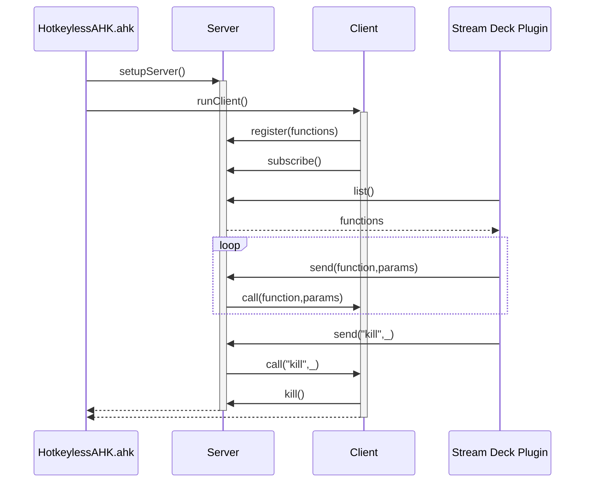

<p align="center">
  <h3 align="center"><a href="https://github.com/sebinside/HotkeylessAHK/releases"></a><br>
  <a href="https://github.com/sebinside/HotkeylessAHK/releases">🔗 Download Release</a></h3>
</p>
<p>&nbsp;</p>

## Hotkeyless AutoHotkey - Using the power of AutoHotkey without hotkeys! 

[](https://www.autohotkey.com/docs/v2/)
[](https://github.com/sebinside/HotkeylessAHK/releases)
[](https://github.com/sebinside/HotkeylessAHK?tab=readme-ov-file#elgato-stream-deck-plugin)

The **AutoHotkey** (AHK) environment is a *powerful tool* to enhance your productivity and *speed up your workflow*. There are so many possibilities and use cases that sometimes... you might *run out of hotkeys*. Or you might want to *combine* AHK-scripts or trigger them from different sources or even from other computers in your local network.

Until now, you had only *two viable solutions*:

- **Exotic key combinations**, like... `CTRL + ALT + F13`. This solution is **fast**, but not very scalable. You might not remember, which hotkeys are still available and sometimes encounter bad side effects with your favorite software.
- **Single AHK-scripts**, which you run directly from AHK or the explorer window. This solution is somewhat **scalable**, well, 
until you loose track of all your AHK files. Additionally, how can you live with the delay of the AHK-process starting up?

**Hotkeyless AutoHotkey** combines the best of both worlds. It's an easy way to expand your AHK-capabilities, both **fast** and **scalable**. But don't take my word for it, here are some numbers:

| Approach                | Call Delay    | Fast | Scalable |
| ----------------------- | :------- | :--: | :------: |
| Key combinations        | ~ 10 ms  |  ✔   |    🞭    |
| Single AHK scripts      | ~ 92 ms  |  🞭   |    ✔    |
| *Hotkeyless AutoHotkey* | ~ 55 ms  |  ✔   |    ✔    |

You can make your own *performance tests*. Just have a look at the `performance-tests`-folder!

Also, **Hotkeyless AutoHotkey** enables the execution of AutoHotkey code from other computers in the same local network. And we also provide a complementary **Elgato Stream Deck** plugin, that enables calling AHK code by simply pressing a button (and without cluttering up your shortcut list).

## Functionality, in a nutshell

**Hotkeyless AHK** internally launches a lightweight web server. Per default, it listens to the endpoint `localhost:42800/send/*` for HTTP requests and redirects them to the `HotkeylessAHK.ahk` script. Simply put, if you call `localhost:42800/send/HelloWorld` using `curl` or by opening it in your web browser, the `HelloWorld()` function inside the AHK-file is executed:

```ahk
HelloWorld() {
    MsgBox, Hello World
}
```

Furthermore, you can include your own AHK scripts using the `#Include` directive and define custom functionality in a nice and clean way - without loosing too much performance. You can use your web browser, shortcuts, or the [Elgato Stream Deck](https://www.elgato.com/gaming/stream-deck) with the **HotkeylessAHK** plugin. This plugin automatically browses existing functions and lets you call them easily.


To increase the reusability of your AHK functions, **HotkeylessAHK** allows you to also pass parameters to the called function, see the example provided in the main [HotkeylessAHK.ahk](https://github.com/sebinside/HotkeylessAHK/blob/main/HotkeylessAHK.ahk) file:

```ahk
; can be called using the URL "localhost:<serverPort>/send/FunctionWithParams?Hello,World"
FunctionWithParams(param1, param2) { 
    MsgBox "Param1: " . param1 . "`nParam2: " . param2
}
```

## Installation

### HotkeylessAHK

*Note: Requires Windows 10 or newer*

1. Install [AutoHotkey](https://www.autohotkey.com/). Well... if you're reading this, you probably already have.
2. Install Node.js. You can download it from https://nodejs.org/. Make sure that Node.js is in the PATH-variable and available from the console. You can test this by opening a console window and executing `node -v`.
3. Clone or download this repository. You can also just head over to [releases](https://github.com/sebinside/HotkeylessAHK/releases).
4. Open a console window within `files` folder. Then, execute `npm i` to install all web server dependencies.
5. Start *Hotkeyless AutoHotkey* by executing the `HotkeylessAHK.ahk`-file.
6. Open your web browser and navigate to `http://localhost:42800/send/HelloWorld`. This should open a message dialog, triggered by the `HotkeylessAHK.ahk`-file.
7. Now, you're ready to go.

*Troubleshooting*: If anything does not work, enable debug mode by setting the boolean value `debug` in the `HotkeylessAHK.ahk` to true. See the section [Configuration](https://github.com/sebinside/HotkeylessAHK?tab=readme-ov-file#configuration) for more details.

### Elgato Stream Deck Plugin

1. Clone or download this repository or a release of it. You probably already have done this during the installation of **HotkeylessAHK** explained above.
2. Make sure you are using a [Elgato Stream Deck](https://www.elgato.com/gaming/stream-deck) and have the Stream Deck Software installed.
3. Identify the Stream Deck Software plugin folder. On Windows, it should be located here: `%appdata%\Elgato\StreamDeck\Plugins\`. Find more information in the [developer documentation](https://docs.elgato.com/streamdeck/sdk/introduction/getting-started/).
4. Copy everything inside of the `stream-deck-plugin` folder into the plugin folder of the Stream Deck Software. It should look like this: `%appdata%\Elgato\StreamDeck\Plugins\de.sebinside.hotkeylessahk.sdPlugin`.
5. Restart the Stream Deck Software. The new plugin should appear in your plugin list.

## Usage

Once installed, the usage of **Hotkeyless AutoHotkey** is easy: Write your functions inside the `HotkeylessAHK.ahk`-file (or include other scripts) and call them with your web browser, the `curl` console command, an Elgato Stream Deck, ...

For keep everything tidy, all functions are organized in classes. By default, the main `HotkeylessAHK.ahk` file comprises one class called `CustomFunctions`:

```ahk
Class CustomFunctions {
    HelloWorld() {
        MsgBox "Hello, World!"
    }
    ; ....
}
```

The endpoint, however, is always the same, per default: `http://localhost:42800/send/YourFunctionNameGoesHere`.

To terminate the running tool, call the reserved kill command name `http://localhost:42800/send/kill`.

If you're using the [Elgato Stream Deck](https://www.elgato.com/gaming/stream-deck) plugin, you will not have to deal with the internals.

## Configuration

**HotkeylessAHK** comes with a working configuration out of the box. However, a couple of things can be configured in the main `HotkeylessAHK.ahk` file:

```ahk
serverPort := 42800 ; sets the server port of the HotkeylessAHK server
functionClassNames := ["CustomFunctions"] ; lists all class names where HotkeylessAHK can call your custom functionality
debug := false ; setting this to true shows the normally hidden console window of the running HotkeylessAHK server
```

## Security

Please note, that **HotkeylessAHK** is not meant to be used in insecure environments as there are *no* security measures like access control implemented! Everyone with access to your localhost can at least run any function that you defined and provided to **HotkeylessAHK**. We are not aware of further remote code execution possibilities via **HotkeylessAHK**, but as we also do not apply any kind of input sanitization, they are probably viable. TL;DR: **HotkeylessAHK** is insecure by design.

## Under the Hood

In the following, the functionality of **HotkeylessAHK** is explained in more detail.
This section is for those who are interested, who want to enhance the tool (thank you!), and for myself in two years (also, thank you!).

Put simply, **HotkeylessAHK** is just a message broker.
It spawns a local web server that redirects *valid* incoming requests to a single subscriber, i.e., the AutoHotkey script.
To decide whether an incoming request is valid, it keeps a list of all function names of all classes specified in the `functionClassNames` parameter, see [Configuration](https://github.com/sebinside/HotkeylessAHK?tab=readme-ov-file#configuration).
The subscribing AutoHotkey script waits for a response to its request to the **HotkeylessAHK** server and executes the according function.
If the function name is `kill`, the script first asks the Node.js server to shut down and than terminates itself.

The following sequence diagram summarizes the communication of **HotkeylessAHK** with other services like the Stream Deck plugin:



## More

This is yet another small tool to enhance the power of AHK. Here are some more links, you might find interesting:

- **[PremiereRemote](https://github.com/sebinside/PremiereRemote)**, another utility tool from me which helps you connect AutoHotkey with the Adobe Premiere CEP scripting environment. A very helpful tool for video production.
- Taran Van Hemert, a macro specialist: https://www.youtube.com/user/TaranVH
- And my own twitch channel, where I develop with these techniques: https://www.twitch.tv/skate702

If there are more questions, you can contact me via [mail](mailto:hi@sebinside.de), see [https://sebastianhahner.de/](https://sebastianhahner.de/).
